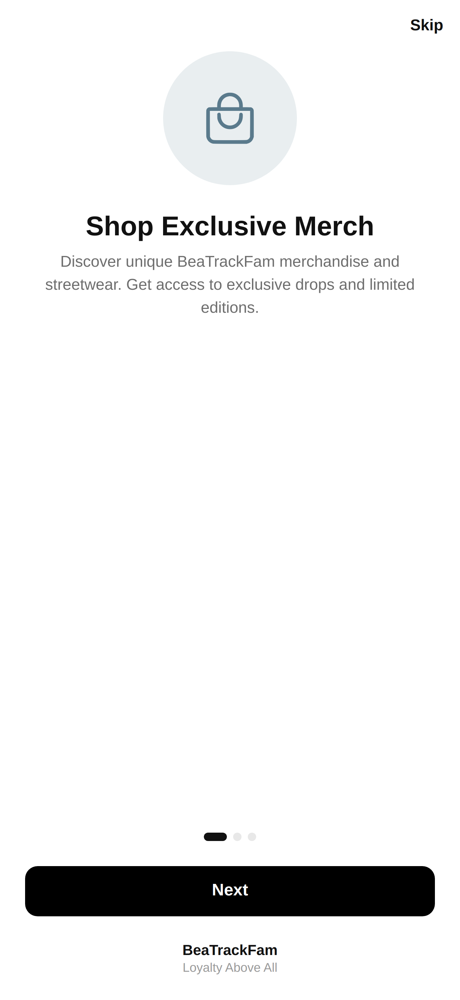
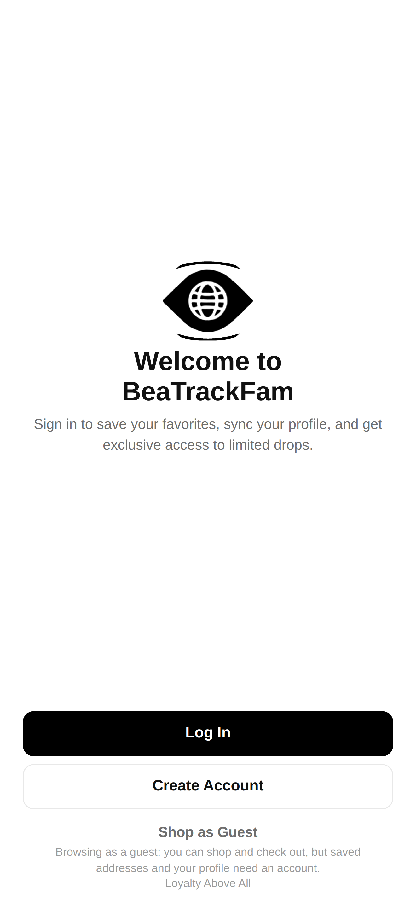
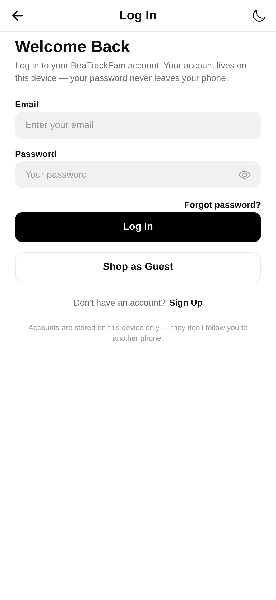
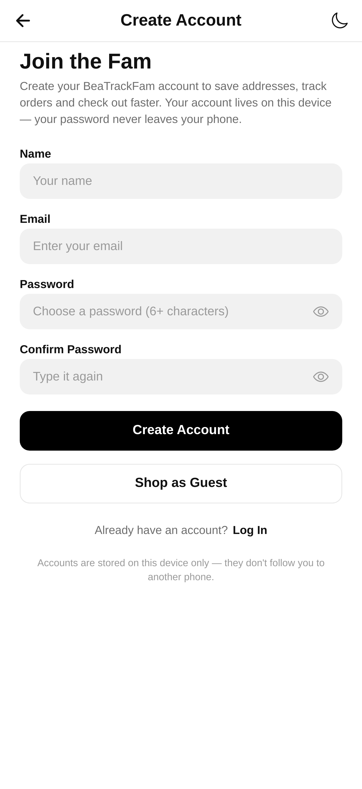
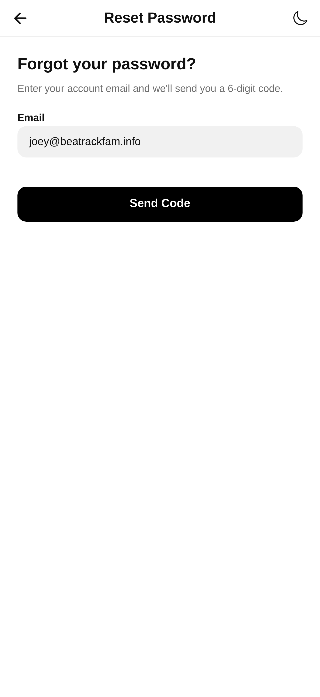
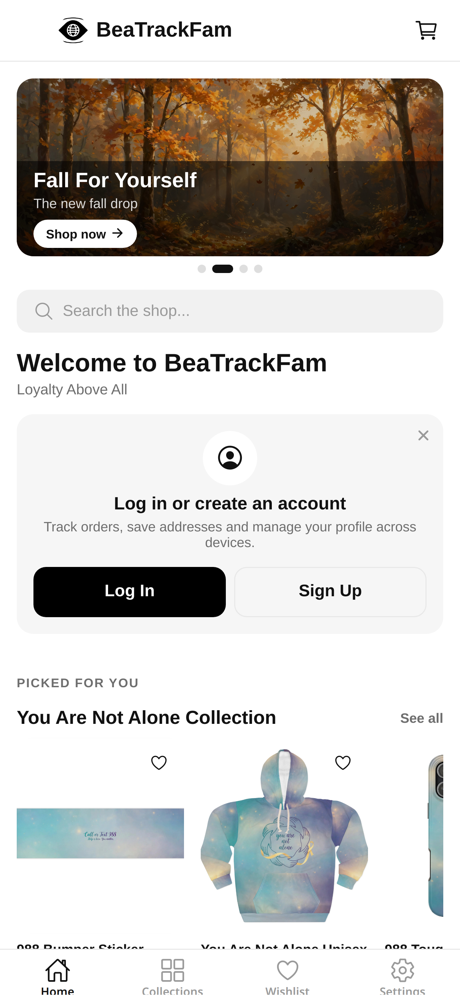
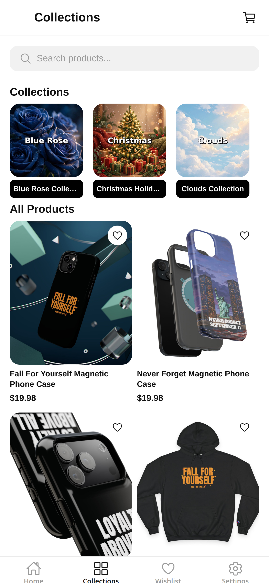
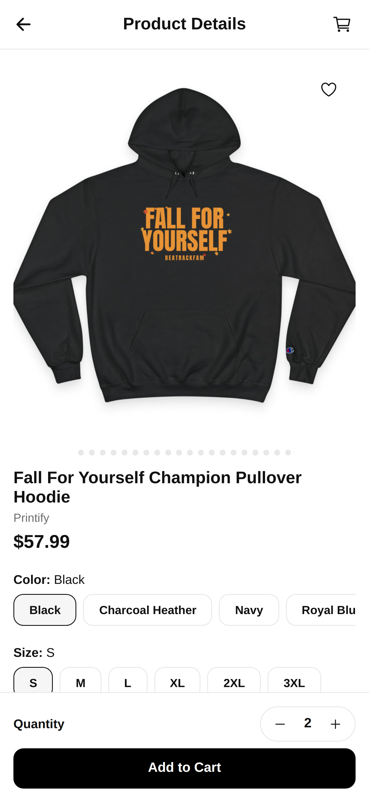
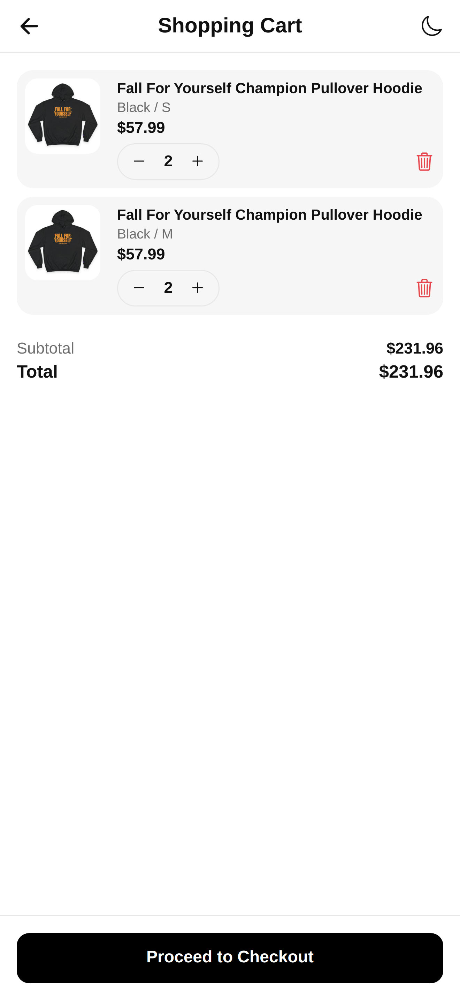
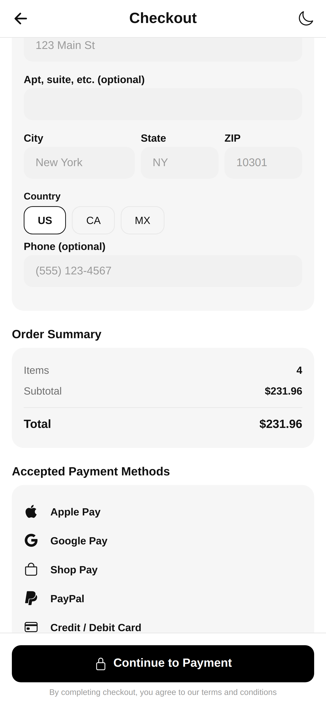

# BeaTrackFam — Official Mobile App

The official iOS and Android shopping app for **BeaTrackFam** ([beatrackfam.info](https://beatrackfam.info)) — a custom-designed merch and apparel brand founded in 2020. Built on one idea: **Loyalty Above All.** Community over profit, good quality at fair prices, and a fam that looks out for each other.

This repository is the full source of the app, its release history, and its published packages. Every version ships here first: source, a version tag, a GitHub Release with the What's New notes and the final project file attached, and an npm package on GitHub Packages.

**Current version:** 8.1.6 (816) · **Bundle ID / package:** `com.beatrackfaminc` · **Platforms:** iOS & Android (Expo / React Native)

---

## Screenshots

| Onboarding | Welcome |
|---|---|
|  |  |
| A three-slide intro to the shop, member perks, and the Loyalty Above All philosophy. | The front door: log in, create an account, or shop as a guest. |

| Log In | Create Account |
|---|---|
|  |  |
| Email + password sign-in. Accounts live on your device — your password never leaves your phone. | Join the fam: save addresses, keep a profile, and check out faster. |

| Forgot Password | Home |
|---|---|
|  |  |
| A 6-digit email code resets your password securely — codes expire in 10 minutes and work once. | Featured banners and "Picked for you" products, pulled live from the store. |

| Collections | Product |
|---|---|
|  |  |
| Every live collection — Loyalty Above All, Never Forget, You Are Not Alone (988), Blue Rose, Clouds, and the seasonal drops. | Swipeable photo gallery with dots and a counter, variant photos that jump to your color/style, star ratings, and full customer reviews. |

| Cart | Checkout |
|---|---|
|  |  |
| Quantity steppers, line totals, and a live subtotal. | Secure Shopify checkout — your name, email, and address ride along so the order is yours in Shopify too. |

---

## What the app does

### Shop the full catalog, live
- The entire storefront loads **live from Shopify** — products, collections, prices, and photos are never stale or hard-coded.
- **Home** with featured banners and a "Picked for you" rail, a **Collections** tab covering every drop, and a **Wishlist** tab for saving favorites.
- Search-friendly product pages with size/color variants, per-variant photos, and quantity selection.

### Product pages that sell the story
- **Swipeable photo gallery** with position dots and a counter; picking a color or style jumps the gallery straight to that variant's photo.
- **Real customer reviews** — read star ratings and written reviews, and share your own, powered by Judge.me through a small Cloudflare Worker so no private tokens ever ship inside the app.

### Cart & secure checkout
- Full cart with quantity steppers and live totals, handed off to **Shopify's secure checkout** (native checkout sheet, with in-app and system browser fallbacks).
- Buyer identity is attached to the Shopify cart at checkout, so orders land in Shopify linked to the customer's email — Printify fulfillment flows exactly like a web order.

### Accounts that respect your privacy
- **Device-local accounts**: sign up and sign in with email + password, stored on the phone as a salted hash. Nothing about sign-in depends on Shopify's APIs, so a Shopify hiccup can never lock you out.
- Profile, saved addresses, interests, socials, and avatar — all editable in the app, all stored on-device.
- **Forgot password** by email code (Cloudflare Worker + Resend; hashed, single-use, 10-minute codes, rate-limited).
- Guests can browse, shop, and check out freely — "Shop as Guest" never signs anyone out, and signing in later carries your guest profile into your account.
- The app **remembers you**: sign in once and every cold start opens straight into the shop. Onboarding is a one-time welcome, not a daily toll booth.
- One honest note: because accounts live on the device, they don't follow you to a different phone.

### Push notifications
- New product drop? New collection? You'll hear about it first.
- Tapping a notification lands right on the product.
- Managed anytime in Settings; self-hosted fan-out (Expo Push Service + a Cloudflare Worker), no third-party marketing platform.

### A permissions center, not permission nagging
- **Settings → App Settings** shows live status for Push Notifications, App Tracking, and Location, read fresh on every launch.
- An in-app notifications toggle that honestly snaps back if the OS says no, and an **Update Device Settings** shortcut when a permission is off at the system level — the app can't override your physical device settings, and it says so.
- Onboarding asks in context: notifications and app tracking on their own explainer screens (the tracking screen is Apple-required and stays), location with one quick system popup at launch.

### Look & feel
- A floating **liquid-glass tab bar** — frosted blur that adapts to light and dark themes, with a translucent fallback so it still reads as glass on older builds.
- Theme-aware branding, the BeaTrackFam eye, and a founder story on the About screen.
- Order receipts kept in the app with full detail; in-app order history syncing is on the roadmap (every order also gets Shopify's confirmation and tracking emails).

---

## Requirements

### For shoppers (minimum OS to download & run)

| Platform | Minimum OS | Notes |
|---|---|---|
| iOS | **iOS 16.4 or later** | iPhone 8 and newer. Set by the app's iOS deployment target (16.4). |
| Android | **Android 7.0 (API 24) or later** | Set by the app's `minSdkVersion` (24). |

### API / OS levels the app targets

| Platform | Level | Value |
|---|---|---|
| Android | Target API (`targetSdkVersion`) | **36 — Android 16** (Google Play's required target for new apps and updates since Aug 31, 2026) |
| Android | Compile API (`compileSdkVersion`) | **36 — Android 16** |
| Android | Minimum API (`minSdkVersion`) | **24 — Android 7.0** |
| iOS | Deployment target (minimum OS) | **iOS 16.4** |

These levels are pinned explicitly in `app.json` (`ios.deploymentTarget`, `android.minSdkVersion` / `compileSdkVersion` / `targetSdkVersion`) and re-checked against current App Store and Google Play requirements at every release, so the app never silently falls behind a store API deadline.

### For developers

- **Node.js 20.19.4 or later** and npm
- **EAS CLI ≥ 16** (`npm install -g eas-cli`) and an Expo account — all iOS/Android builds and store submissions run through EAS, so no local Xcode or Android Studio is required
- A development build on a real device or simulator (the app uses native modules; Expo Go alone is not enough)

## Tech stack

| Layer | What |
|---|---|
| App | Expo SDK 57 · React Native 0.86 · TypeScript |
| Navigation | Expo Router (file-based routes, route groups) |
| Catalog & checkout | Shopify Storefront API + Checkout Sheet Kit |
| Reviews | Judge.me API via Cloudflare Worker (token stays server-side) |
| Push | Expo Push Service + Cloudflare Worker (HMAC-verified Shopify webhooks; new product/collection triggers) |
| Password reset | Cloudflare Worker + Resend (hashed single-use codes) |
| Storage | AsyncStorage (accounts, session, profile, preferences — all on-device) |
| Builds & submission | EAS Build / EAS Submit |
| Releases | GitHub Releases + GitHub Packages (npm) |

## Getting started (development)

Requirements: Node.js 20.19.4+, npm, EAS CLI, and the Expo dev client build on device (the app uses native modules — Expo Go is not enough).

```bash
git clone https://github.com/Joeey1116/BeaTrackFam-Mobile-App.git
cd BeaTrackFam-Mobile-App
npm install
npx expo start
```

For a fresh native build (needed after adding any native module, e.g. blur/notifications):

```bash
eas build --profile development
```

Production builds use `eas build --profile production` and `eas submit`. Android builds need `google-services.json` in the project root (it ships inside every release file).

## Releases & packages

- Every version is **committed and pushed** here, tagged `vX.Y.Z`, and published as a **GitHub Release** titled `Version X.Y.Z (build number)` — description is the *What's new in this version* notes, and the final project zip is attached as a release asset.
- The same version is published to **GitHub Packages** as the private npm package `@joeey1116/beatrackfam-mobile-app`, automatically, by the *Publish npm package* workflow whenever a release goes live.
- Version bumps touch `app.json`, `package.json`, the in-app version lines, and the splash build label — all in sync, every time.

## About BeaTrackFam

Custom tees, hoodies, sweatshirts, and more — designed in-house, printed on demand, priced so the fam doesn't break the bank. BeaTrackFam started in 2020 and runs on community: real people, real loyalty, real support (including the You Are Not Alone / 988 collection, because nobody in this fam struggles alone).

- Store: [beatrackfam.info](https://beatrackfam.info)
- Social: **@beatrackfam** on Instagram, Facebook, and Threads
- Questions or concerns? Email us at **contact@beatrackfam.info**

*Loyalty Above All.*
