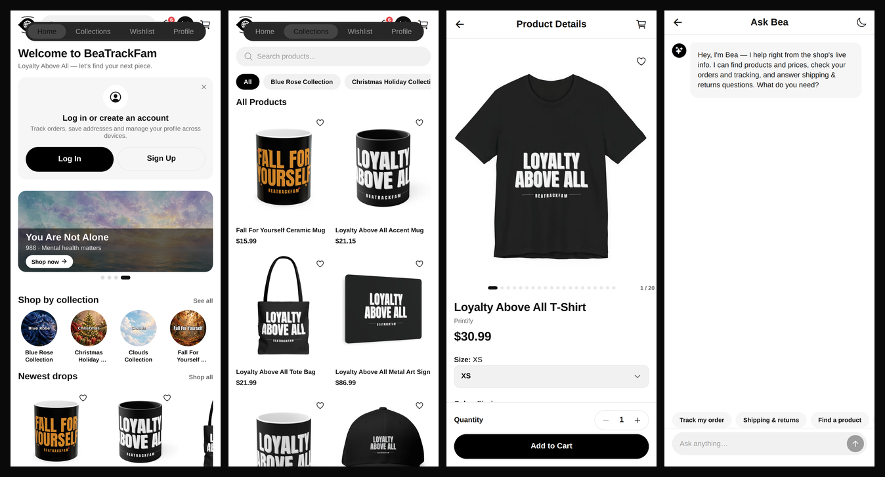

# BeaTrackFam — Official Mobile App

The official iOS and Android shopping app for **BeaTrackFam** ([beatrackfam.info](https://beatrackfam.info)) — a custom-designed merch and apparel brand founded in 2020. Built on one idea: **Loyalty Above All.** Community over profit, good quality at fair prices, and a fam that looks out for each other.

This repository is the full source of the app and its release history. Every version ships here first: source, a version tag, and a GitHub Release with the What's New notes and the final project file attached.

**Version in development:** 12.2.3 (iOS build 1207 · Android versionCode 1206) · **Live in stores:** 10.1.0 · **Bundle ID / package:** `com.beatrackfaminc` · **Platforms:** iOS & Android (Expo / React Native)

> Build numbers increment by exactly 1 on every store upload (TestFlight, App Store, or Google Play), even when the marketing version doesn't change — the stores reject reused build numbers.

---

## Screenshots

The current 12.2.x design — Home, Shop, a product page, and Ask Bea:



---

## What the app does

### Shop the full catalog, live
- The entire storefront loads **live from Shopify** — products, collections, prices, and photos are never stale or hard-coded.
- **Home** with the newest drops and fam favorites, a searchable **Shop** with collection filters, and a **Wishlist** for saving finds.
- Product pages with variants, photo galleries, prices, and **real customer reviews** (powered by Judge.me through a Cloudflare Worker, so no private tokens ever ship inside the app).
- **Pull-to-refresh on every main screen** — Home, Shop, Wishlist, Profile, Order History, Inbox, and product pages.

### Check out without leaving the app
- **Full in-app checkout**: pay by card, **Apple Pay**, or **Google Pay** through Stripe's payment sheet — no bouncing out to a browser.
- **Real promo codes, applied live**: codes are checked against Shopify as you type, so your discount, shipping, and tax are right there before you pay.
- Orders land in Shopify tagged as app checkouts and flow into Printify fulfillment exactly like a web order. (Products still need to be enabled for the app sales channel in Shopify to check out.)

### Your account, orders, and inbox
- **Shopify account sign-in** — email, or *Continue with Shopify* — the same account you use on the website.
- **Order History with live tracking**: orders appear instantly, with full details and tracking links, and you can **request a cancellation** right from the order (before it ships).
- **Fam member card** in your profile with your true order count.
- **Inbox**: order updates and new-drop alerts in one place.
- **Ask Bea**, our in-app help assistant — answers on orders, shipping, returns, and promo codes, and connects you to a real human through Shopify chat when we're online (she knows our store hours).

### Earn with the Fam
- The **Earn With the Fam** section points affiliates to the BeaTrackFam affiliate program (managed through the Pro Affiliates app by GoAffPro — separate from this app).

### Push notifications
- New product drop? New collection? You'll hear about it first, and tapping a notification lands right on the product.
- Managed anytime in Settings; fan-out is self-hosted (Expo Push Service + a Cloudflare Worker), no third-party marketing platform.

### Look & feel
- The 12.0.0–12.2.3 releases are a **complete redesign**: an original black & white BeaTrackFam look built around the fam — bolder, faster, easier to shop. Eye logo, dark UI, loyalty up front.
- Theme-aware branding and a founder story on the About screen.

---

## Requirements

### For shoppers (minimum OS to download & run)

| Platform | Minimum OS | Notes |
|---|---|---|
| iOS | **iOS 16.4 or later** | Set by the app's iOS deployment target (16.4). |
| Android | **Android 7.0 (API 24) or later** | Set by the app's `minSdkVersion` (24). |

### API / OS levels the app targets

| Platform | Level | Value |
|---|---|---|
| Android | Target API (`targetSdkVersion`) | **36 — Android 16** (Google Play's required target for new apps and updates since Aug 31, 2026) |
| Android | Compile API (`compileSdkVersion`) | **36 — Android 16** |
| Android | Minimum API (`minSdkVersion`) | **24 — Android 7.0** |
| iOS | Deployment target (minimum OS) | **iOS 16.4** |

These levels are pinned explicitly in `app.json` (`ios.deploymentTarget`, `android.minSdkVersion` / `compileSdkVersion` / `targetSdkVersion`) and re-checked against current App Store and Google Play requirements at every release, so the app never silently falls behind a store API deadline.

### For developers

- **Node.js 20.19.4 or later** and npm
- A development build on a real device or simulator (the app uses native modules; Expo Go alone is not enough)

## Tech stack

| Layer | What |
|---|---|
| App | Expo SDK 57 · React Native 0.86 · TypeScript |
| Navigation | Expo Router (file-based routes, route groups) |
| Catalog | Shopify Storefront API |
| Checkout | Stripe PaymentSheet (in-app) + checkout Cloudflare Worker → Shopify Admin API |
| Accounts | Shopify Customer Account API (email + Continue with Shopify) |
| Reviews | Judge.me API via Cloudflare Worker (token stays server-side) |
| Push | Expo Push Service + Cloudflare Worker |
| Password reset | Cloudflare Worker + Resend (hashed single-use codes) |
| Storage | AsyncStorage (cart, session, preferences — on-device) |
| Store builds | GitHub Actions (iOS: auto-upload to TestFlight; Android: upload to Google Play production with release notes) |

Sanitized sources for the Cloudflare Workers live in [`workers/`](workers/) (`checkout`, `accounts`, `password-reset`, `push`, `reviews`).

## Getting started (development)

Requirements: Node.js 20.19.4+, npm, and a dev-client build on device (the app uses native modules — Expo Go is not enough).

```bash
git clone https://github.com/Joeey1116/BeaTrackFam-Mobile-App.git
cd BeaTrackFam-Mobile-App
npm install
npx expo start
```

For a fresh native build (needed after adding any native module):

```bash
eas build --profile development
```

Store-bound builds ship from the GitHub Actions workflows (see below), not from a local machine.

## Releases & packages

- **Versioning**: one version = one big bundle of changes — small fixes accumulate on `main`, and each store upload bumps the build number by exactly 1 (see the note up top).
- Every release is **committed and pushed** here, tagged `vX.Y.Z`, and published as a **GitHub Release** titled `Version X.Y.Z (NNN)` (build number in parentheses). The description is the *What's new in this version* notes (source in [`store/`](store/)), and the final project zip is attached as a release asset.
- **iOS**: the *Build iOS IPA* GitHub Actions workflow archives the app and uploads it to **TestFlight** automatically.
- **Android**: the *Build Android AAB* workflow uploads straight to **Google Play production** on dispatch, with the Play release notes attached.
- The same version is published to **GitHub Packages** as the private npm package `@joeey1116/beatrackfam-mobile-app`, automatically, when a GitHub Release goes live.

## About BeaTrackFam

Custom tees, hoodies, sweatshirts, and more — designed in-house, printed on demand, priced so the fam doesn't break the bank. BeaTrackFam started in 2020 and runs on community: real people, real loyalty, real support (including the You Are Not Alone / 988 collection, because nobody in this fam struggles alone).

- Store: [beatrackfam.info](https://beatrackfam.info)
- Social: **@beatrackfam** on Instagram, Facebook, TikTok, and Threads
- Questions or concerns? Email us at **contact@beatrackfam.info**

*Loyalty Above All.*
